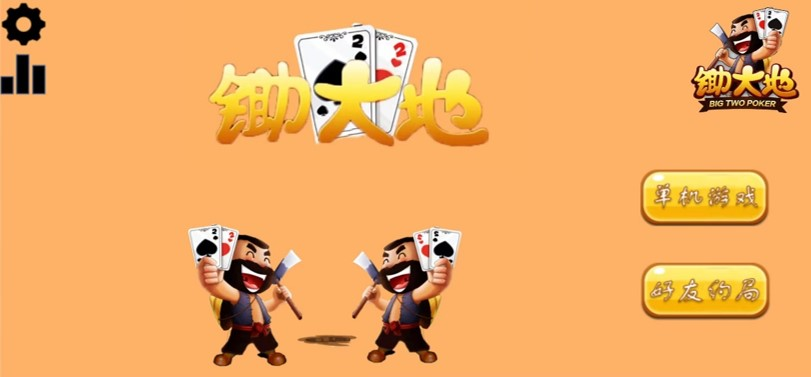
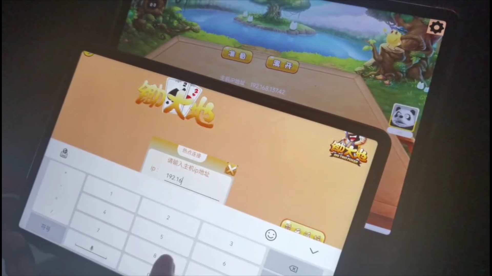

华南理工大学软件学院软件开发实训课程设计-锄大地游戏

2023.5-2023.7 软件开发实训

## 设计特点

本次项目是对于UML课程所学知识的一次实践。

##### 架构特点

- MVC架构
- GOF模式中的Stragey, State, Singleton模式

###### 游戏特点

- 经典的UI设计

- 单机对局、人机AI算法
- wifi局域网联机对局

###### 实训要求与评分标准

（1）掌握starUML进行UML7大图建模                                  

（2）进行需求分析和面向对象的设计，并且进行分析建模和设计建模。

（3）详细设计时，注意引入必要的设计模式，优化设计。                                 

（4）完成UI的界面设计，实现不同页面的切换。                                   

（5）适配玩家自由选择南北规则的不同玩法。                                  

（6）实现用户间的蓝牙，WIFI连接，提供多名玩家联机对战功能。

（7） 对扑克牌博弈AI模块，提供不同AI算法实现策略，软件适配不同的AI博弈算法模块。 至少2钟AI算法策略，需要使用策略模式。 （由于时间限制，同学们可不考虑，学有余力者可以尝试，这部分不参与期末计分）   

## UI设计

## 运行

app-release.apk:  可直接安装的apk

SCUT_CDD：Android Studio 源文件

演示视频.mp4： 项目答辩时的演示视频

## 实机测试

## 团队成员

